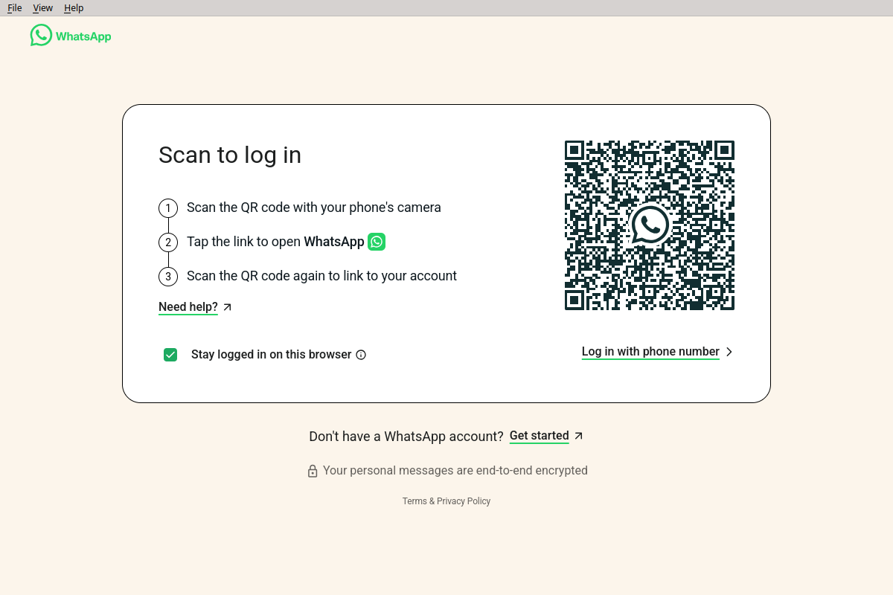
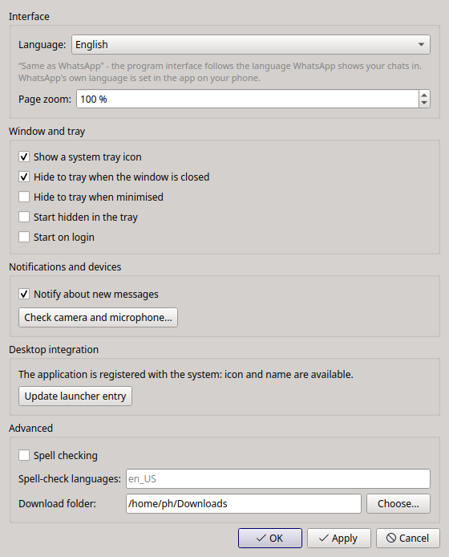

# Corvo

**Неофициальный клиент WhatsApp Web для Linux.** Оболочка над `web.whatsapp.com`
на C++17 / Qt 6 / Qt WebEngine: программа выглядит как обычное приложение рабочего
стола — меню, системный трей со счётчиком непрочитанных, уведомления freedesktop,
сохранение сессии и геометрии окна.

> Corvo — независимый проект. WhatsApp является товарным знаком WhatsApp LLC /
> Meta Platforms, Inc. Проект не связан с ними, не одобрен и не спонсируется ими;
> он лишь отображает публичный веб-интерфейс, использование которого подчиняется
> правилам WhatsApp.

| | |
|---|---|
| Версия | 2.0.0 |
| Лицензия | MIT |
| Требуется | Qt 6.11+, GCC 12, CMake + Ninja |
| Проверено на | Debian 12 (bookworm), X11 и Wayland |
| App ID | `io.github.artushenko_sergei.Corvo` |

## Как выглядит

| Вход | Настройки |
|---|---|
|  |  |

## Поддержать разработку

Программа бесплатная и с открытым исходным кодом. Если она вам полезна, поддержать
разработку можно по ссылкам в разделе Donate (будут добавлены).

---

## 1. Возможности

| Раздел | Реализация |
|---|---|
| Главное окно | `QMainWindow` + `QWebEngineView`, `https://web.whatsapp.com`, 1200×800 по умолчанию |
| Сессия | `QWebEngineProfile` с `persistentStoragePath` + `ForcePersistentCookies` — QR-код сканируется один раз |
| Звонки | включены `SharedArrayBuffer` и `RTCRtpScriptTransform` — без них WhatsApp сообщает, что браузер не поддерживает звонки |
| Камера/микрофон | `permissionRequested(QWebEnginePermission)` → авторазрешение `MediaAudioCapture`, `MediaVideoCapture`, `MediaAudioVideoCapture`, `DesktopVideoCapture`, `ClipboardReadWrite` |
| Диагностика | «Настройки → Проверить камеру и микрофон»: `enumerateDevices()`, предпросмотр камеры, индикатор уровня микрофона, список `/dev/video*` |
| Безопасность | `file://` запрещён, JS не имеет доступа к локальным файлам, в главном фрейме разрешён только `web.whatsapp.com` |
| Трей | `QSystemTrayIcon` со счётчиком непрочитанных, статусом и меню; закрытие окна = скрытие в трей |
| Уведомления | `org.freedesktop.Notifications` через D-Bus, замена по `tag`, клик открывает нужный чат; резерв — сообщения трея |
| Автозапуск | `~/.config/autostart/Corvo.desktop` (переключатель в настройках) |
| Язык | интерфейс следует языку WhatsApp (он приходит с телефона); русский, английский, немецкий, украинский; ручной выбор — в настройках |
| Настройки | `QSettings` (INI): язык, размер и позиция окна, трей, автозапуск, уведомления, путь профиля, масштаб |
| User-Agent | выводится из UA самого Qt: убирается токен `QtWebEngine/…`, версия Chromium сохраняется; если движок сообщает Chrome старше 110, берётся строка Chrome/120 |
| Логи | `QLoggingCategory` + файл `~/.local/share/Corvo/logs/Corvo.log` (с ротацией) |
| Ошибки | страница ошибки с повтором, автоперезагрузка при возврате сети (`QNetworkInformation`), лог падений render-процесса |
| Пакет | CPack → `Corvo_1.3.4+25_amd64.deb` (локальный: Qt подключается через RPATH), плюс каталог `debian/` |

---

## 2. Версионирование

Схема — **Semantic Versioning 2.0.0**, номер сборки как build-метаданные:

```
MAJOR . MINOR . PATCH + BUILD          текущая: 1.3.4+25
```

| Часть | Когда поднимается |
|---|---|
| `MAJOR` | несовместимое изменение поведения или формата данных (структура профиля, ключи настроек без миграции) |
| `MINOR` | новая функциональность с сохранением совместимости |
| `PATCH` | только исправление ошибок |
| `BUILD` | **при каждом изменении**, даже если MAJOR/MINOR/PATCH не двигаются (документация, упаковка, рефакторинг); счётчик строго монотонный |

Единственный источник истины — `CMakeLists.txt`:

```cmake
project(Corvo VERSION 1.3.4 ...)
set(CORVO_BUILD 25)
```

Из них выводится всё остальное: макросы `CORVO_VERSION` / `CORVO_BUILD` /
`CORVO_VERSION_FULL` в коде, `--version`, диалог «Версия», заголовок в логе,
версия `.deb` и имя файла пакета. Руками версию нигде больше править не нужно.

Подъём — скриптом, он же добавляет запись в `debian/changelog`:

```bash
scripts/bump-version.sh build  "поправлена ошибка в разборе заголовка"   # 1.3.4+25 → 1.3.4+26
scripts/bump-version.sh patch  "исправлено падение при обрыве сети"      # 1.3.4+25 → 1.3.5+26
scripts/bump-version.sh minor  "добавлен экспорт чатов"                  # 1.3.4+25 → 1.4.0+26
scripts/bump-version.sh major  "новый формат каталога профиля"           # 1.3.4+25 → 2.0.0+26
```

После подъёма нужно пересобрать — версия попадает в бинарник на этапе компиляции:

```bash
cmake --build build && (cd build && cpack -G DEB)
```

`Version=1.0` в `.desktop`-файлах — это версия *спецификации* Desktop Entry,
а не приложения; её менять не нужно (в файлах стоят соответствующие комментарии).

Формат версии совместим с Debian: `+` допустим в upstream-версии, а цифры после
него сравниваются численно, поэтому `1.0.0+9 < 1.0.0+10` и `apt` корректно видит
обновление. Пакет нативный (`debian/source/format` = `3.0 (native)`), поэтому
ревизии `-1` в версии нет.

---

## 3. Структура проекта

```
Corvo/
├── CMakeLists.txt              # сборка, install, CPack (.deb)
├── main.cpp                    # только bootstrap: флаги Chromium, логи, single instance
├── README.md
│
├── src/
│   ├── MainWindow.{h,cpp}          # окно, меню, статус-бар, геометрия, трей/уведомления
│   ├── WebPage.{h,cpp}             # QWebEnginePage: QWebEnginePermission, URL-политика, логи JS
│   ├── WebProfile.{h,cpp}          # QWebEngineProfile: сессия, кэш, cookies, орфография
│   ├── Settings.{h,cpp}            # QSettings-обёртка, автозапуск, ярлык в меню
│   ├── Localization.{h,cpp}        # выбор языка и установка переводчиков
│   ├── SettingsDialog.{h,cpp}      # диалог настроек
│   ├── TrayManager.{h,cpp}         # QSystemTrayIcon, меню, бейдж непрочитанных
│   ├── NotificationManager.{h,cpp} # D-Bus org.freedesktop.Notifications
│   ├── DeviceCheckDialog.{h,cpp}   # «Проверка камеры»
│   └── Logger.{h,cpp}              # QLoggingCategory + файл логов
│
├── translations/               # Corvo_{en,de,uk}.ts (компилируются в .qm)
│
├── resources/
│   ├── resources.qrc
│   ├── icons/                  # Corvo.svg + PNG 16…256
│   └── html/devicecheck.html   # страница диагностики устройств
│
├── packaging/
│   ├── Corvo.desktop
│   └── deb/{postinst,postrm}   # обновление кэшей .desktop и иконок
│
├── scripts/
│   └── bump-version.sh         # подъём версии + запись в debian/changelog
│
└── debian/                     # control, rules, changelog, copyright, source/format
```

---

## 4. Установка зависимостей

Сборочные инструменты из репозитория:

```bash
sudo apt install build-essential cmake ninja-build
```

**Qt 6.11+** — из официального установщика (https://www.qt.io/download-qt-installer),
компоненты: *Qt 6.11.x → Desktop gcc 64-bit* и *Qt WebEngine*. По умолчанию проект
ищет его в `~/opt/Qt/6.11.1/gcc_64`.

Qt из репозитория Debian 12 (6.4) не подходит — нужен API `QWebEnginePermission`
(Qt 6.8+). Пакеты `qt6-webengine-dev` не требуются и вообще не используются.

Для сборки через `dpkg-buildpackage` нужен дистрибутив, в репозитории которого
уже есть Qt ≥ 6.11 (Debian trixie/sid), плюс:

```bash
sudo apt install debhelper devscripts pkgconf
```

---

## 5. Сборка

```bash
cmake -S . -B build -G Ninja
cmake --build build
```

Qt подхватывается автоматически, если лежит в `~/opt/Qt/6.11.1/gcc_64`; иначе:

```bash
cmake -S . -B build -G Ninja -DCMAKE_PREFIX_PATH=/путь/к/Qt/6.11.x/gcc_64
```

Конфигурация печатает, что именно нашла:

```
-- Using Qt from /home/ph/opt/Qt/6.11.1/gcc_64 (override with -DCMAKE_PREFIX_PATH=...)
-- Install RPATH set to /home/ph/opt/Qt/6.11.1/gcc_64/lib (Qt outside the system prefix)
-- Package mode: LOCAL - the .deb expects Qt 6.11.1 in /home/ph/opt/Qt/6.11.1/gcc_64/lib
-- Corvo 1.3.4 (build 25)
```

В Qt Creator — просто выберите Kit с Qt 6.11.

Запуск без установки (ресурсы вкомпилированы, работает сразу):

```bash
./build/Corvo
```

Параметры запуска:

```bash
./build/Corvo --hidden      # старт свёрнутым в трей
./build/Corvo --version     # Corvo 1.3.4+25
./build/Corvo --help
```

> ⚠️ Каталог сессии `~/.local/share/Corvo/profile` пишет Chromium той версии,
> которая его открыла. Переход на более новый Qt переносится нормально, откат на
> более старый может обесценить сессию и потребовать нового QR-кода.

---

## 6. Пакет .deb и установка

### Установка себе (пакетом)

```bash
cd build
cpack -G DEB
sudo apt install ./Corvo_1.3.4+25_amd64.deb
```

Пакет ставит:

```
/usr/bin/Corvo
/usr/share/applications/Corvo.desktop
/usr/share/icons/hicolor/{16x16,…,256x256}/apps/Corvo.png
/usr/share/icons/hicolor/scalable/apps/Corvo.svg
/usr/share/pixmaps/Corvo.png
/usr/share/doc/Corvo/README.md
```

Зависимости пакета — только `libc6` и `libstdc++6`: Qt находится по RPATH,
вкомпилированному в бинарник (`/home/ph/opt/Qt/6.11.1/gcc_64/lib`).

Удаление:

```bash
sudo apt remove corvo                              # программа
rm -rf ~/.local/share/Corvo ~/.config/Corvo   # + сессия и настройки
```

> После установки пакета переключите «Автозапуск» в настройках выключить→включить,
> если он был включён при запуске из каталога сборки: в
> `~/.config/autostart/Corvo.desktop` остался бы путь к старому бинарнику.
> Приложение записывает `/usr/bin/Corvo`, когда тот существует.

### Установка без пакета

```bash
sudo cmake --install build            # в /usr/local
```

RPATH выставляется автоматически, поэтому установленный бинарник находит Qt.

### ⚠️ Этот .deb — локальный, его нельзя раздавать

Пакет содержит только приложение, но не Qt, а Qt 6.11 нет в репозиториях Debian
12/Ubuntu. На чужой машине бинарник не запустится:

```
libQt6Core.so.6: version `Qt_6.11' not found
```

Поэтому CMake намеренно **не** прописывает зависимости от системных Qt-пакетов
(иначе `apt` установил бы неработающий пакет) и печатает при конфигурации
`Package mode: LOCAL`. Пакет годится для машин, где по тому же пути лежит тот же Qt.

Чтобы раздавать другим, Qt нужно упаковать вместе с приложением — вариантов три:

| Вариант | Что даёт | Размер |
|---|---|---|
| **AppImage** (`linuxdeploy` + `linuxdeploy-plugin-qt`) | один файл, запускается на любом дистрибутиве | ~200–250 МБ |
| **Самодостаточный .deb** (`/opt/corvo` + `RPATH $ORIGIN/../lib`) | привычная установка через `apt` | ~200–250 МБ |
| **Flatpak** (рантайм `org.kde.Platform`) | Qt и WebEngine из рантайма, публикация на Flathub | ~30 МБ + рантайм |

Ни один из них пока не собран. Сборка `dpkg-buildpackage` из каталога `debian/`
рассчитана на дистрибутив, где Qt ≥ 6.11 есть в репозитории (Debian trixie/sid).

---

## 7. Где хранятся данные

| Что | Путь |
|---|---|
| Сессия WhatsApp (cookies, localStorage, IndexedDB) | `~/.local/share/Corvo/profile/` |
| Дисковый кэш HTTP | `~/.local/share/Corvo/cache/` |
| Логи приложения | `~/.local/share/Corvo/logs/Corvo.log` |
| Логи Chromium | `~/.local/share/Corvo/logs/chromium.log` |
| Настройки | `~/.config/Corvo/Corvo.conf` |
| Автозапуск | `~/.config/autostart/Corvo.desktop` |

Полный сброс (потребуется снова сканировать QR-код):

```bash
rm -rf ~/.local/share/Corvo ~/.config/Corvo
```

---

## 8. Меню

* **Файл** — Открыть профиль · Открыть журнал · Настройки… · Выход
* **Вид** — Показать окно · Скрыть в трей · Перезагрузить · Полный экран (F11) · масштаб ±
* **Помощь** — О программе: значок, название, версия и сборка, одна строка о
  назначении, разработчик, версия Qt и краткая формулировка о свободной лицензии.
  Технических путей там нет — они в журнале и в этом файле

Меню трея: статус · Показать окно · Скрыть в трей · Перезагрузить · Проверка камеры ·
Настройки… · Выход. Левый клик по значку — показать/скрыть окно.

Заголовок окна всегда «Corvo»; счётчик непрочитанных показывается на значке
в трее и в его подсказке. Строка состояния внизу появляется только когда есть что
сказать — загрузка страницы, пропавшая сеть, скачивание файла, заблокированный
переход — и снова скрывается.

---

## 9. Проверка камеры и микрофона

«Настройки → Проверить камеру и микрофон» открывает диалог, который использует **тот же профиль WebEngine**,
что и WhatsApp, поэтому результат совпадает с тем, что видит WhatsApp Web.

Отчёт выглядит так:

```
=== Системные устройства ===
/dev/video0  доступно для чтения

=== Запрос устройств через navigator.mediaDevices ===
videoinput:
- Integrated Camera
audioinput:
- Built-in Audio Analog Stereo
audiooutput:
- Built-in Audio Analog Stereo
```

Кнопки: «Проверить устройства» (`enumerateDevices()`), «Включить камеру» (живой предпросмотр),
«Проверить микрофон» (индикатор уровня), «Остановить».

---

## 10. Язык интерфейса и иконка

### Язык

Интерфейс программы по умолчанию **следует языку WhatsApp**. Причина простая: у
WhatsApp Web нет своей настройки языка — привязанный клиент берёт язык с телефона,
и менять его из программы нельзя. Поэтому программа не спорит со страницей, а
подстраивается под неё, и окно целиком говорит на одном языке.

Как это работает:

1. Страница сообщает свой язык в `document.documentElement.lang` (проверено:
   при немецком браузере `"de"`, при русском `"ru"` — совпадает с текстом на странице).
2. После загрузки и затем каждые 20 секунд приложение спрашивает это значение —
   повторные проверки нужны, потому что WhatsApp меняет язык в момент привязки
   телефона, без перезагрузки страницы.
3. Если язык поддерживается и отличается от текущего, переводчики подменяются на
   ходу: Qt рассылает `QEvent::LanguageChange`, меню и меню трея переписываются
   **без перезапуска**.
4. Определённый язык запоминается (`ui/detectedLanguage`), чтобы следующий запуск
   сразу открывался на нужном языке, а не мигал после загрузки страницы.

В журнале это видно так:

```
corvo.app: Following WhatsApp interface language: "uk" (page reported "uk")
corvo.app: Interface retranslated to "uk"
corvo.tray: Tray menu retranslated
```

Поддерживаются четыре языка: **русский** (исходный, в нём написаны строки в коде),
**английский**, **немецкий**, **украинский**. Если WhatsApp показывает язык, для
которого перевода нет (например испанский), интерфейс остаётся на текущем.

В «Настройки → Интерфейс → Язык» можно вместо «Как в WhatsApp» выбрать язык
принудительно — применяется сразу по кнопке «Применить». Выбранный язык уходит и в
Chromium (`--lang`, `Accept-Language`), то есть влияет на язык **экрана входа**;
после привязки телефона язык страницы задаёт WhatsApp.

Переводы лежат в `translations/Corvo_{en,de,uk}.ts`, компилируются в `.qm` и
**вкомпилированы в бинарник** (`:/i18n/`), внешних файлов не нужно. Строки Qt
(кнопки «OK», «Отмена») подхватываются из `qtbase_<код>.qm` установки Qt.

Добавить язык или обновить строки после правки `tr()`:

```bash
cmake --build build --target update_translations   # обновить .ts
linguist translations/Corvo_de.ts             # перевести
cmake --build build                                # .qm попадут в бинарник
```

Новый язык: положить `translations/Corvo_<код>.ts`, дописать его в
`qt_add_translations` в `CMakeLists.txt`, в `Settings::availableLanguages()`,
`Settings::languageDisplayName()` и в `translatedLanguages()` в `Localization.cpp`.

### Звонки

WhatsApp Web проверяет возможности движка и, если чего-то нет, показывает
«Ваш браузер не поддерживает функцию звонков», а кнопки звонка не работают.
Qt WebEngine по умолчанию не отдаёт двух вещей, поэтому приложение включает их
флагами Chromium (`main.cpp`, `setupChromiumFlags()`):

| Флаг | Что включает | Зачем |
|---|---|---|
| `--enable-features=SharedArrayBuffer` | `SharedArrayBuffer` | движок звонков — WebAssembly с потоками; Chromium отдаёт SAB только cross-origin-isolated страницам, а `web.whatsapp.com` таковой не является (`crossOriginIsolated === false`) |
| `--enable-blink-features=RTCRtpScriptTransform` | Encoded Transform API | сквозное шифрование звонков преобразует закодированные кадры; в сборке Qt есть только старый `createEncodedStreams()` |

Списки фич **объединяются**, а не дописываются: Chromium оставляет только последнее
вхождение `--enable-features`, поэтому второй такой ключ молча затирал бы первый
(включая `WebRTCPipeWireCapturer` для демонстрации экрана на Wayland).

Проверить, что движок отдаёт нужное, можно в консоли страницы:

```js
[window.SharedArrayBuffer, window.RTCRtpScriptTransform,
 RTCRtpSender.prototype.createEncodedStreams].map(v => typeof v)
// ожидается: ["function", "function", "function"]
```

> **Про SharedArrayBuffer.** Ключ включает его без cross-origin isolation — это тот
> же обход, что и корпоративная политика Chrome `SharedArrayBufferUnrestrictedAccessAllowed`.
> Он ослабляет одну из мер против атак класса Spectre. Для приложения, которое
> открывает единственный сайт `web.whatsapp.com` (и запрещает любую другую
> навигацию — см. раздел про безопасность), это осознанный компромисс.

> **Про кодек H.264.** Официальные сборки Qt WebEngine идут без проприетарных
> кодеков: `canPlayType('video/mp4; codecs="avc1"')` возвращает пусто. Для звонков
> это не важно — WebRTC использует VP8/VP9/AV1 и Opus, они на месте
> (`RTCRtpSender.getCapabilities`). Но присланные в чате видео в H.264 внутри
> программы не проиграются. Лечится только сборкой Qt WebEngine с
> `-webengine-proprietary-codecs`.

### Иконка

Иконка приложения берётся из темы (`QIcon::fromTheme("Corvo")`), а если её там
нет — из вкомпилированного ресурса. На Wayland значок в панели задач и в
уведомлениях композитор ищет **сам**, по `app_id`, поэтому важны две вещи:

1. `QGuiApplication::setDesktopFileName("Corvo")` — **без** `.desktop`, как
   требует документация Qt. С расширением композитор искал `Corvo.desktop.desktop`
   и не находил ничего, из-за чего иконки не было вовсе.
2. В системе должен быть `.desktop`-файл с `Icon=Corvo`. Он появляется при
   установке пакета; при запуске из каталога сборки нажмите
   «Настройки → Приложение в системе → Добавить в меню приложений» — программа
   создаст `~/.local/share/applications/Corvo.desktop` и значки в
   `~/.local/share/icons/hicolor/`.

---

## 11. Логи

Категории: `corvo.app`, `corvo.web`, `corvo.permission`, `corvo.notify`, `corvo.tray`,
`corvo.settings`, `corvo.media`.

```bash
tail -f ~/.local/share/Corvo/logs/Corvo.log
```

Пример записи о запросе разрешения:

```
2026-07-30T12:00:01.412 [info] corvo.permission: Permission request:
  MediaVideoCapture
  origin: https://web.whatsapp.com/
2026-07-30T12:00:01.413 [info] corvo.permission: Granted: MediaVideoCapture for https://web.whatsapp.com/
```

Фильтрация категорий стандартными средствами Qt:

```bash
QT_LOGGING_RULES="corvo.web=false" ./build/Corvo
```

---

## 12. Особенности X11 и Wayland

Проверено на Debian 12 (KDE), обе платформы, обе версии Qt:

| | X11 / XWayland | нативный Wayland |
|---|---|---|
| Трей, счётчик непрочитанных | ✅ | ✅ (StatusNotifierItem) |
| Скрытие в трей → восстановление с фокусом | ✅ | ✅ |
| Размер окна сохраняется | ✅ | ✅ |
| **Позиция окна сохраняется** | ✅ | ❌ невозможно, см. ниже |
| Уведомления, камера, микрофон | ✅ | ✅ |
| `QT_QPA_PLATFORM=offscreen` | работает | — |

**Позиция окна на Wayland.** Протокол не даёт клиенту позиционировать себя:
`move()` игнорируется, а `pos()` возвращает координаты, которые нельзя
переиспользовать (например начало координат монитора, который выбрал
композитор). Поэтому на Wayland приложение сохраняет только размер окна и
намеренно **не трогает** сохранённую позицию — иначе один запуск под Wayland
затирал бы координаты, корректные для сеанса X11. В логе это видно так:

```
corvo.app: Platform "wayland" does not support client-side window positioning;
          only the window size is persisted
```

**`offscreen` и headless/CI.** На Qt 6.11 платформа `offscreen` работает, WhatsApp
Web грузится headless. (На Qt 6.4 она падала в софтварном рендерере Qt Quick —
`QSGSoftwareRenderableNode::update`, ограничение `QQuickWidget`, исправленное
апстримом; при откате на старый Qt нужен `xvfb-run`.)

**Сообщение WhatsApp `storage bucket persistence denied`** в консоли — его
собственная некритичная диагностика (`navigator.storage.persist()`), на
сохранение сессии не влияет: cookies, localStorage и IndexedDB лежат на диске в
каталоге профиля.

---

## 13. Диагностика проблем

| Симптом | Что делать |
|---|---|
| «unsupported browser» на web.whatsapp.com | User-Agent подменяется на Chrome 120 в `WebProfile::defaultUserAgent()`; проверьте, что в настройках не задан свой UA |
| QR-код запрашивается каждый раз | проверьте права на `~/.local/share/Corvo/profile`; в логах должно быть `Cookies policy: ForcePersistentCookies` |
| Камера не найдена | `ls -l /dev/video*`, `lsmod \| grep uvcvideo`, членство в группе `video`; затем «Проверка камеры» |
| Нет звука в звонках | нужен работающий PipeWire/PulseAudio: `pactl info` |
| Нет уведомлений | должен быть запущен демон уведомлений; в логах — `Using org.freedesktop.Notifications` или предупреждение о резерве через трей |
| Нет значка в трее | в GNOME нужен AppIndicator-расширение; без трея закрытие окна завершает приложение |
| Не работает демонстрация экрана на Wayland | приложение само добавляет `--enable-features=WebRTCPipeWireCapturer`; нужен `xdg-desktop-portal` |
| Окно открывается не там, где было на Wayland | ожидаемо, см. раздел 12 — Wayland не даёт клиенту задавать позицию |

Переопределить флаги Chromium можно через окружение:

```bash
QTWEBENGINE_CHROMIUM_FLAGS="--enable-logging --v=1" ./build/Corvo
```

---

## 14. Итоговая проверка

```bash
cmake -S . -B build -G Ninja && cmake --build build    # ✓ собирается (Qt 6.11)
./build/Corvo                                     # ✓ запускается, открывает WhatsApp Web
                                                       # ✓ QR-код только при первом запуске
                                                       # ✓ камера/микрофон определяются («Проверка камеры»)
                                                       # ✓ видеозвонки и звук работают
                                                       # ✓ уведомления и трей работают
cd build && cpack -G DEB                               # ✓ Corvo_1.3.4+25_amd64.deb
```

---

## 15. Лицензия и товарные знаки

Код — MIT (см. `debian/copyright`). WhatsApp является товарным знаком WhatsApp LLC / Meta
Platforms, Inc. Проект не связан с ними, не одобрен и не спонсируется ими; это лишь оболочка
над публичным веб-интерфейсом, использование подчиняется условиям WhatsApp.
